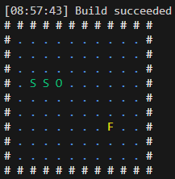

# Bienvenue dans notre jeu Snake personnalisé !

Notre idée de jeu : créer une version de base qui correspond au jeu Snake, puis ajouter des variantes telles que "pour grandir il faut seulement manger les nombres qui sont des multiples de 3", etc. Une autre variante pourrait typiquement être un pacman ! On enlève la dimension de changement de taille, et on peut ajouter des ennemis par exemple.

# Sous-domaine et périmètre

Titre du sous-domaine : *Matrice 2D "snake-like"*

## Concepts centraux

Le sous-domaine s’appuie sur une grille discrète représentant l’espace de jeu, dans laquelle évolue un ou plusieurs joueurs (ou serpents) dont la taille peut varier au fil du temps. Les déplacements sont limités aux quatre directions principales (haut, bas, gauche, droite). Le système gère les collisions, qui peuvent être bloquantes (fin de partie), non bloquantes (récupération d’objets) ou éliminantes. Des objets apparaissent de manière aléatoire sur la grille et peuvent être ramassés pour accumuler des points ou modifier la taille du joueur. Enfin, la situation de fin de partie (game over) est définie selon plusieurs critères, comme une collision avec soi-même, un mur, ou un dépassement de chronomètre.

## Familles de jeux visées

Ce sous-domaine vise exclusivement les jeux 2D se déroulant sur une grille discrète, centrés sur des mécaniques proches du jeu Snake classique et ses variantes. Il exclut expressément les jeux 3D, les jeux multijoueurs, les systèmes complexes de tournoi multi-tables, et tout gameplay basé sur des mécanismes autres que le déplacement et la collecte sur grille (par exemple, pas de physique continue ni d’environnement ouvert).

## Pourquoi c’est atteignable et fécond en variantes

Le jeu repose sur des états successifs simples, clairement définis et entièrement descriptibles, ce qui facilite la modélisation et la mise en œuvre.
Les concepts fondamentaux du sous-domaine (taille du joueur, collisions, apparition d’objets, type d’objets) sont indépendants mais peuvent être combinés et paramétrés de nombreuses manières, générant ainsi une grande diversité de variantes possibles. Par exemple, on peut ajuster la taille de la grille, le comportement aux bordures, la nature des objets ou les règles de fin de partie.

## Comment compiler un fichier FourchLang (.fl)

La compilation n'est possible que si les fichiers du language FourchLang ont été générés, pensez donc au préalable avant de suivre le restant de cette partie à exécuter les commandes suivantes : 
```shell 
~$ npm run langium:generate
~$ npm run build
```
Et en vous plaçant à l'aide d'un terminal dans le dossier FourchLang de ce projet.

La commande, à lancer dans un terminal, permettant de passer d'un fichier **.fl** contenant la description du jeu dans son état initial à un fichier contenant l'affichage de la grille de jeu de snake dans l'état décrit est la suivante : 

```shell 
~$ npm run generate --source=[chemin/vers/fichier/source] --destination=[chemin/où/mettre/le/fichier/généré]
```
Cette commande retourne par défaut un fichier texte avec une représentation de l'état initial d'un jeu de Snake en art ASCII.
Elle affiche égalementdans le terminal le même affichage, cette fois-ci en couleur.

Exemple de compilation obtenue avec le fichier suivant : 
```fl 
grid size 10 x 9

border horizontal not crossable
border vertical not crossable

fruits reappear when eaten

player blob at (3, 3) with size 2

snake body bobA at (2, 3) following blob
snake body bobB at (1, 3) following bobA

fruit at (7, 6) worth 1

game over when hitting snake_body
game over when hitting enemy
game over when hitting border
```

Fichier obtenu :
```ansi
# # # # # # # # # # # # 
# . . . . . . . . . . #
# . . . . . . . . . . #
# . . . . . . . . . . #
# . S S O . . . . . . #
# . . . . . . . . . . #
# . . . . . . . . . . #
# . . . . . . . F . . #
# . . . . . . . . . . #
# . . . . . . . . . . #
# # # # # # # # # # # # 
```
Affichage dans le terminal : 

