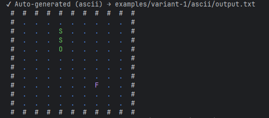

# Bienvenue dans notre jeu Snake personnalisé !

Notre idée de jeu : créer une version de base qui correspond au jeu Snake, puis ajouter des variantes telles que "pour grandir il faut seulement manger les nombres qui sont des multiples de 3", etc. Une autre variante pourrait typiquement être un pacman ! On enlève la dimension de changement de taille, et on peut ajouter des ennemis par exemple.

---

# Sous-domaine et périmètre

**Titre du sous-domaine :**
*Matrice 2D “snake-like”*

Ce sous-domaine couvre les jeux se déroulant sur une **grille 2D discrète**, où les entités évoluent case par case selon des règles explicites.

---

## Concepts centraux

Le sous-domaine repose sur les concepts suivants :

* **Grille discrète**
  L’espace de jeu est une matrice 2D de taille finie, composée de cellules.

* **Serpents (joueurs et ennemis)**
  Un ou plusieurs serpents occupent la grille.

    * Chaque serpent possède une tête et éventuellement un corps.
    * La taille peut évoluer (croissance, décroissance, taille fixe).
    * Les déplacements sont limités aux **quatre directions cardinales** : haut, bas, gauche, droite.

* **Objets de la grille**

    * Fruits (positifs, négatifs, conditionnels…),
    * Murs,
    * Bordures de la carte (crossables ou non).

* **Interactions et collisions**

    * Collision avec soi-même,
    * Collision avec un mur,
    * Collision avec un ennemi,
    * Traversée ou non des bordures.

* **Conditions de fin de partie**
  Le *game over* peut être déclenché par :

    * une collision spécifique,
    * le franchissement d’une bordure non autorisée,
    * ou toute autre règle définie par la variante.

L’ensemble de ces règles est **entièrement déclaratif** : aucune logique implicite n’est cachée.

---
## Familles de jeux visées

Ce sous-domaine vise exclusivement les jeux 2D se déroulant sur une grille discrète, centrés sur des mécaniques proches du jeu Snake classique et ses variantes. Il exclut expressément les jeux 3D, les jeux multijoueur·euse·s, les systèmes complexes de tournoi multi-tables, et tout gameplay basé sur des mécanismes autres que le déplacement et la collecte sur grille (par exemple, pas de physique continue ni d’environnement ouvert).

---

## Pourquoi c’est atteignable et fécond en variantes

Ce sous-domaine est à la fois **simple à implémenter** et **riche en possibilités** :

* Les états du jeu sont **finis, discrets et parfaitement décrits**.
* Chaque règle (croissance, collision, bordure, objet) est **indépendante**, mais combinable.
* Une modification locale (ex. bordure crossable) peut produire une **variante radicalement différente**.

Quelques exemples de paramètres facilement modulables :

* taille de la grille,
* comportement des bordures (crossable horizontalement, verticalement, ou non),
* règles de croissance,
* nature et valeur des fruits,
* présence ou absence d’ennemis,
* conditions exactes de défaite.

Cela rend FourchLang particulièrement adapté à l’**exploration systématique de variantes de gameplay**.

---

## 🛠️ Comment compiler un fichier FourchLang (.fl)

### Pré-requis

Avant toute génération, assure-toi que le langage et ses backends ont été compilés.

Depuis le dossier racine du projet **FourchLang** :

```shell
npm run langium:generate
npm run build
```

---

### Génération automatique par variante

Pour générer automatiquement une variante existante :

```shell
npm run generate:auto -- --variant=[num-variant] --backend=[format]
```

Exemples de formats possibles :

* `ascii`
* `html`
* `json`

---

### Génération manuelle

Commande générique :

```shell
npm run generate -- [source] [destination] [backend]
```

Par défaut, la génération produit :

* un fichier texte ASCII,
* et affiche également la grille colorée dans le terminal.

---

### Générer un playable HTML (jeu interactif)

```shell
npm run generate -- examples/variant-2/program.fl examples/variant-2/playable/index.html --target playable
```

---

### Générer tous les fichiers (batch)

```shell
npm run generate:ascii:all
npm run generate:html:all
npm run generate:json:all
npm run generate:playable:html:all
```

Ces commandes fonctionnent aussi bien sous **bash** que sous **PowerShell**, car elles utilisent Node.js pour la boucle.

---

## Exemple complet

### Fichier FourchLang (`.fl`)

```fl
grid size 10 x 9

border horizontal not crossable
border vertical not crossable

fruits reappear when eaten

player blob at (3, 3) with size 2

snake body bobA at (2, 3) following blob
snake body bobB at (1, 3) following bobA

fruit at (7, 6) worth 1

game over when hitting snake_body
game over when hitting enemy
game over when hitting border
```

---

### Fichier généré (ASCII)

```ansi
 #  #  #  #  #  #  #  #  #  #  # 
 #  .  .  .  .  .  .  .  .  .  # 
 #  .  .  .  S  .  .  .  .  .  # 
 #  .  .  .  S  .  .  .  .  .  # 
 #  .  .  .  O  .  .  .  .  .  # 
 #  .  .  .  .  .  .  .  .  .  # 
 #  .  .  .  .  .  .  .  .  .  # 
 #  .  .  .  .  .  .  .  .  .  # 
 #  .  .  .  .  .  .  F  .  .  # 
 #  .  .  .  .  .  .  .  .  .  # 
 #  .  .  .  .  .  .  .  .  .  # 
 #  #  #  #  #  #  #  #  #  #  #
```

---

### Affichage dans le terminal

