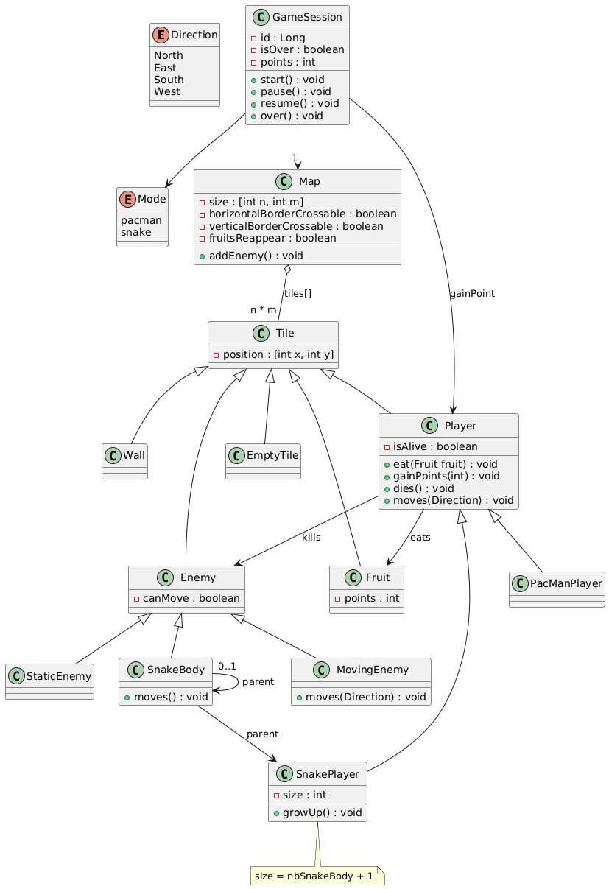

# 1. Project overview
<!-- Done -->
FourchLang is a domain-specific language (DSL) for describing snake-like games played on a 2D discrete grid.
A program specifies the grid, borders, players/snakes, objects (fruits, enemies, walls) and game-over conditions, which are then compiled to an executable game or a visual representation (ASCII / GUI).​
The focus is on deterministic, turn-based updates (up, down, left, right) with simple collision and scoring rules, making it easy to explore many gameplay variants (multiples-of-3 fruits, pacman-like modes, etc.).​
The project is implemented with Langium (TypeScript) and uses Node.js tooling (npm run langium:generate, generators, tests).​
Optional AI agents (rule-based or LLM-controlled via OpenRouter) can play the game, evaluate variants, or act as opponents.​


# 2. Representative DSL programs with some explanations
<!-- Done -->
We have created five representative examples of what can be done with our DSL.
# Variation 1: Classic “Snake” game

The code contained in the `program.fl` file in this folder represents the configuration of a classic “Snake” game, with a snake that is 3 squares long, a grid that is 10 squares long by 9 squares wide, and one piece of fruit already present.  
Eating a piece of fruit with the snake increases the score by 1 and lengthens the snake by one square.  
Coming into contact with a square where the snake is located ends the game.
The edges of the grid can be crossed, causing the snake to reappear on the other side if it passes through an edge.  
Fruit reappears in an empty square as soon as it is eaten by the snake.

<video controls src="snake1-2026-01-19_10.18.29.mov" title="SnakeGame-Variant1"></video>

# Variation 2: Classic “Snake” game with closed edges

The code contained in the `program.fl` file in this folder represents the configuration of a “Snake” game with closed edges, with a snake that is 3 squares long, a grid that is 10 squares long by 9 squares wide, and one piece of fruit already present.  
Eating a fruit with the snake increases the score by 1 and lengthens the snake by one square.  
Eaten fruits reappear on a random empty square 2 seconds after they are eaten.  
Touching the edge of the grid ends the game.

<video controls src="snake2-2026-01-19_10.27.18.mov" title="SnakeGame-Variant2"></video>

# Variation 3: “Snake” game with enemies Snake

The code contained in the `program.fl` file in this folder resembles the configuration of a classic “Snake” game with a snake that is 4 squares long, a grid that is 10 squares long by 9 squares wide, and a fruit already present.  
The difference with the classic “Snake” is the addition of an enemy, which is also a snake 4 squares long.  
Eating a piece of fruit with the snake increases the score by 1, and it reappears in an empty square as soon as it is eaten.  
The edges of the grid can be crossed, causing the snakes to reappear on the opposite side of the grid.  
Coming into contact with a square where a snake (ally or enemy) is located ends the game.

<video controls src="snake3-2026-01-19_10.30.42.mov" title="SnakeGame-Variant3"></video>

# Variation 4: Pac-Man

The code contained in the `program.fl` file in this folder resembles the configuration of a single-player Pac-Man game, with a grid 29 squares long by 28 squares wide, walls, fruit, and enemies.  
There is a passage between the left and right edges towards the middle of the grid, so the vertical border can be crossed. The horizontal border cannot.  
Eating a piece of fruit with the player increases the score by 10. The fruit does not reappear.  
Several enemies are present in the grid.  
Coming into contact with a square containing an enemy ends the game.

<video controls src="snake3-2026-01-19_10.32.04.mov" title="SnakeGame-Variant4"></video>

# Variation 5: Custom “Snake” game

The code contained in the `program.fl` file in this folder represents the configuration of a custom “Snake” game, with a snake that is 3 squares long, a grid that is 4 squares long by 3 squares wide, one enemy, and two pieces of fruit already present. There is one healthy fruit and one rotten fruit. There are also impassable walls. The edges are impassable.  
Eating a healthy fruit with the snake increases the score by 4 and lengthens the snake by one square.  
Eating a rotten fruit with the snake decreases the score by 4 and lengthens the snake by one square.  
Touching a square where the snake is located ends the game.
Touching the enemy ends the game.
Touching an edge ends the game.

<video controls src="snake3-2026-01-19_10.34.28.mov" title="SnakeGame-Variant5"></video>


# 3. How to run

## To generate variations
The commands to execute are as follows:
- ```cd Fourchlang```
- ```npm install```
- ```npm run build```

Then:
- ```npm run generate -- [source] [destination] [config]```
  
or
- ```npm run generate:auto -- --variant=2 --backend=ascii```

backend= ascii or json or html depending on the desired output

[EXEMPLE]

```npm run generate -- examples/variant-2/program.fl examples/variant-2/output.txt ascii```

## To generate a playable and play: 
### Python
At the root of the project, execute:
- ```python3 "./FourchLang/src/backends/playable/python/play.py" "./FourchLang/examples/variant-1/json/output.json"```
- ```python3 "./FourchLang/src/backends/playable/python/play.py" "./FourchLang/examples/variant-2/json/output.json"```
- ```python3 "./FourchLang/src/backends/playable/python/play.py" "./FourchLang/examples/variant-3/json/output.json"```
- ```python3 "./FourchLang/src/backends/playable/python/play.py" "./FourchLang/examples/variant-4/json/output.json"```
- ```python3 "./FourchLang/src/backends/playable/python/play.py" "./FourchLang/examples/variant-5/json/output.json"```

It displays a new window with the game, you can play with the arrow keys of your keyboard.
### HTML
- ```cd FourchLang```
- ```npm run generate:playable:html:all```
- ```npx http-server -p 8080```

Then you can play if you open this [link](http://127.0.0.1:8080) (http://127.0.0.1:8080) and go to `examples>variant-1>playable>html`.
It opens a browser tab with the game, you can play with the arrows, and you can try various algorithm moves by clicking on the corresponding button.

<video controls src="snake1html-2026-01-19_11.40.57.mov" title="SnakeVariation1HTML"></video>
<!-- TODO IA -->


# 4. Grammar and metamodel and class diagram
<!-- TODO Alice -->
The Fourchlang grammar can be found [here](FourchLang/src/language/fourch-lang.langium).


The metamodel diagram can be found [here](model/class/class.puml).



# 5. AIs : strengths/weaknesses, known failure modes
<!-- TODO -->
To make our AI play any variant of snake precendently mentionned, start by generating a json of the desired program (see section "#3. How to run").<br/>
To then launch a game where our AI actually plays the selected variant, run the following command at the root of the project : <br/> 
```python3 "./FourchLang/src/backends/playable/python/play-ai.py" "./FourchLang/examples/variant-[X]/json/output.json" snake-ai```<br/>
with X being the chosed variant.<br/><br/>
This will open a window with the game running, where you can witness the AI playing the game. This window will close itself when the AI loses or if you click on the cross button on its top-right corner. <br/>
A "next_state.json" file is also generated at the root of the project, displaying every move made by the AI until end of its trial.
# 6. LLM protocol
<!-- TODO -->


# 7. Mini-evaluation <!-- Optional -->
<!-- TODO -->
# 8. Unsupported features and limitations
<!-- TODO -->
# 9. Lessons learned
<!-- TODO -->
# 10. Ressources
# Previous README (French)
## Bienvenue dans notre jeu Snake personnalisé !

Notre idée de jeu : créer une version de base qui correspond au jeu Snake, puis ajouter des variantes telles que "pour grandir il faut seulement manger les nombres qui sont des multiples de 3", etc. Une autre variante pourrait typiquement être un pacman ! On enlève la dimension de changement de taille, et on peut ajouter des ennemis par exemple.

## Sous-domaine et périmètre

Titre du sous-domaine : *Matrice 2D "snake-like"*

### Concepts centraux

Le sous-domaine s’appuie sur une grille discrète représentant l’espace de jeu, dans laquelle évolue un·e ou plusieurs joueur·euse·s (ou serpents) dont la taille peut varier au fil du temps. Les déplacements sont limités aux quatre directions principales (haut, bas, gauche, droite). Le système gère les collisions, qui peuvent être bloquantes (fin de partie), non bloquantes (récupération d’objets) ou éliminantes. Des objets apparaissent de manière aléatoire sur la grille et peuvent être ramassés pour accumuler des points ou modifier la taille du joueur·euse. Enfin, la situation de fin de partie (game over) est définie selon plusieurs critères, comme une collision avec soi-même, un mur, ou un dépassement de chronomètre.

### Familles de jeux visées

Ce sous-domaine vise exclusivement les jeux 2D se déroulant sur une grille discrète, centrés sur des mécaniques proches du jeu Snake classique et ses variantes. Il exclut expressément les jeux 3D, les jeux multijoueur·euse·s, les systèmes complexes de tournoi multi-tables, et tout gameplay basé sur des mécanismes autres que le déplacement et la collecte sur grille (par exemple, pas de physique continue ni d’environnement ouvert).

### Pourquoi c’est atteignable et fécond en variantes

Le jeu repose sur des états successifs simples, clairement définis et entièrement descriptibles, ce qui facilite la modélisation et la mise en œuvre.
Les concepts fondamentaux du sous-domaine (taille du ou de la joueur·euse, collisions, apparition d’objets, type d’objets) sont indépendants mais peuvent être combinés et paramétrés de nombreuses manières, générant ainsi une grande diversité de variantes possibles. Par exemple, on peut ajuster la taille de la grille, le comportement aux bordures, la nature des objets ou les règles de fin de partie.

### Comment compiler un fichier FourchLang (.fl)

La compilation n'est possible que si les fichiers du language FourchLang ont été générés, pensez donc au préalable avant de suivre le restant de cette partie à exécuter les commandes suivantes : 
```shell 
~$ npm run langium:generate
~$ npm run build
```
Et en vous plaçant à l'aide d'un terminal dans le dossier FourchLang de ce projet.

La commande, à lancer dans un terminal, permettant de passer d'un fichier **.fl** contenant la description du jeu dans son état initial à un fichier contenant l'affichage de la grille de jeu de snake dans l'état décrit est la suivante : 

```shell 
~$ npm run generate:auto -- --variant=[num-variante] --backend=[format-export]
```
```shell 
~$ npm run generate -- [source] [destination] [backend]
```
Cette commande retourne par défaut un fichier texte avec une représentation de l'état initial d'un jeu de Snake en art ASCII.
Elle affiche égalementdans le terminal le même affichage, cette fois-ci en couleur.

Exemple de compilation obtenue avec le fichier suivant : 
```fl 
grid size 10 x 9

border horizontal not crossable
border vertical not crossable

fruits reappear when eaten

player blob at (3, 3) with size 2

snake body bobA at (2, 3) following blob
snake body bobB at (1, 3) following bobA

fruit at (7, 6) worth 1

game over when hitting snake_body
game over when hitting enemy
game over when hitting border
```

Fichier obtenu :
```ansi
# # # # # # # # # # # # 
# . . . . . . . . . . #
# . . . . . . . . . . #
# . . . . . . . . . . #
# . S S O . . . . . . #
# . . . . . . . . . . #
# . . . . . . . . . . #
# . . . . . . . F . . #
# . . . . . . . . . . #
# . . . . . . . . . . #
# # # # # # # # # # # # 
```
Affichage dans le terminal : 


